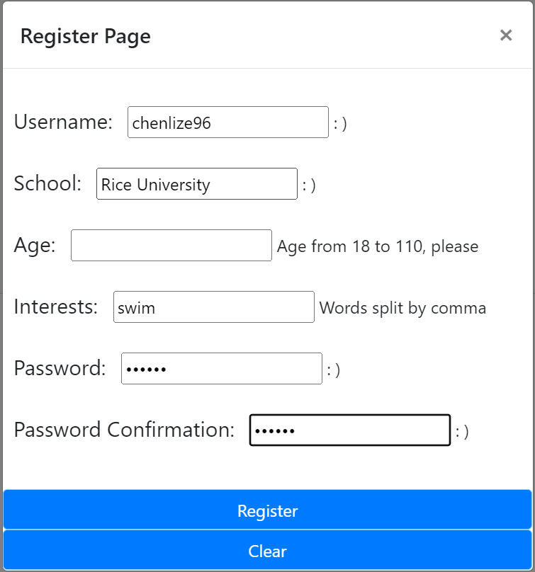

# Chat App

Link: https://chatapp-final-team-dog.herokuapp.com/
<!-- TABLE OF CONTENTS -->
<h2 id="table-of-contents">Contents</h2>
  <ol>
    <li><a href="#desc"> ➤ Description</a></li>
    <li><a href="#handbook"> ➤ User handbook</a></li>
    <li><a href="#contributors"> ➤ Contributors</a></li>
  </ol>
 

<h2 id="desc"> 1. Description</h2>

| Landing | Register |
|:----------:|:----------:|
|  |  |

 
<h2 id="handbook"> 2. User Handbook</h2>

<ol>

<li> Enter the application:</li>

   Register an account and log in. You can also login to the system directly using the following four registered accounts:

   admin, 123

   aaa, 123

   bbb, 123

   ccc, 123

<li> Create a chat room</li>

   Click on the create button and follow the instruction. Click save, then the room will show on the available rooms list.

<li> Join a public room</li>

   Click the join button and select from available rooms. You can see the current number of users and the size of a room. A welcome message will show in the admin's chat room.

<li> See information update</li>

   Click on a room name, then you will see updates on the right part of the page. 

<li> Join a private room</li>

   The admin should click on a room name and invite a user, for example, user aaa. If aaa clicks on the notification button and accepts, this room will appear on the available room list. 

<li>  Send messages</li>

   User A and user B should click on the same room name, enter messages, then press enter.

<li>  Delete messages</li>

   At first, User A and admin should click on the same room name and send messages. Messages will appear in the chat history. If the admin click delete then click history. User A's messages will disappear from the chat history of this chat room.  

<li>  Recall messages</li>

   At first, User A send messages in a chat room. Messages will appear in the chat history. If User A click recall then click history. User A's messages will be recalled from the chat history of this chat room. 

<li>  Block</li>

   The admin should click on the block button and select a user. The user's messages will not show in this chat room's chat area.

<li>  Mute</li>

    The admin should click on the user name, then click the mute button. This user will receive a notification and cannot send messages.

<li> Kick</li>

    The admin should click on the user name, then click the kick button. This user will receive a notification and leave the room immediately.

<li>  Hate speech monitor</li>

    An unblocked user will receive a warning notification at the first time he/she says hate speech. This user cannot send messages if he/she says hate speech again.

<li> See chat history</li>

    Click a room name and click on the history button.

<li>  Leave a room</li>

    Click on a room name and click the leave button.

<li>  Leave all rooms</li>

    Click on a room name and click the leave all button.

<li>  Log out</li>

    Click on the bye button on the bottom left corner.

</ol>

 
<h2 id="contributors"> 3. Contributors</h2>

Team Lead: Lize Chen

Tech Lead: Huaminghui Ding

Documentation Lead: Tingting Li

Developer: Daolun Chen

Developer: Ruimin Li

Developer: Yichen Sun

Developer: Junhao Yu

